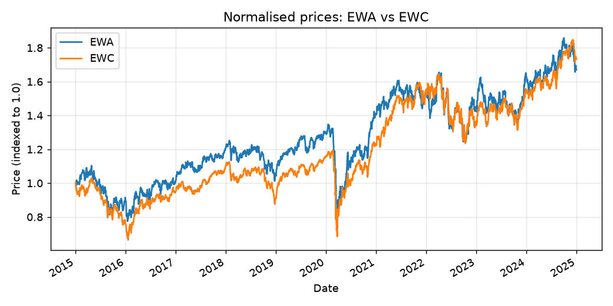
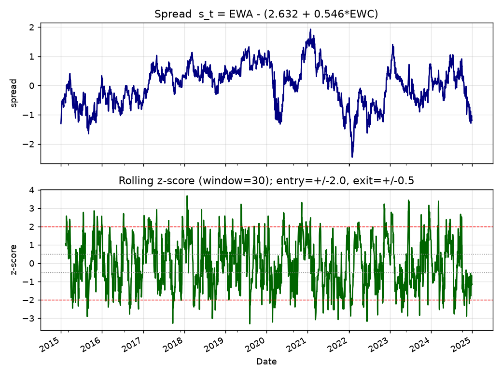
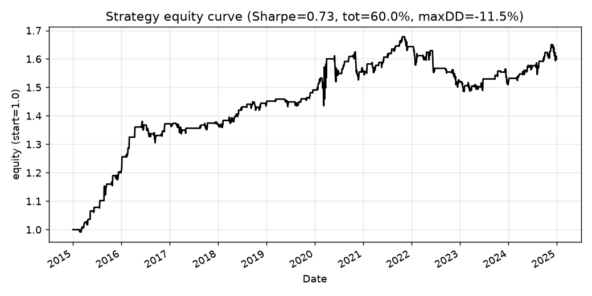
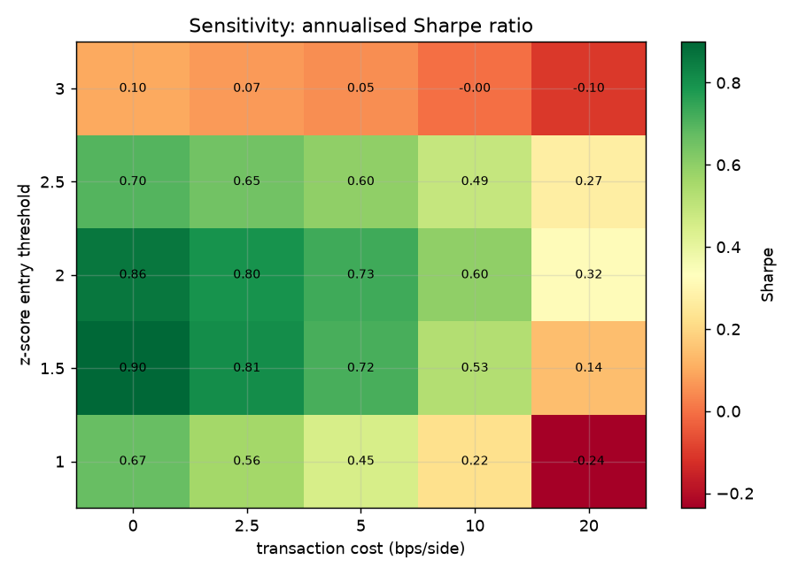

# quant-statarb-research

**A cointegration-based statistical-arbitrage / pairs-trading research project** — full
methodology, reproducible Python code, a compiled LaTeX paper, and a deployed results site.

**Live demo:** https://maddoxk.github.io/quant-statarb-research/
&nbsp;·&nbsp; **Paper (PDF):** [paper.pdf](./paper.pdf)
&nbsp;·&nbsp; **Data:** real market data (iShares MSCI Australia/Canada ETFs, 2015–2024, via yfinance, bundled as CSV)

---

## Overview

We build a market-neutral pairs-trading strategy on the classic **EWA** (iShares MSCI
Australia) / **EWC** (iShares MSCI Canada) ETF pair — two commodity-linked country equity
indices that share a long-run common factor. The full pipeline is:

1. **Universe selection** — a related, historically cointegrated equity pair.
2. **Cointegration testing** — Engle–Granger two-step (ADF on OLS residuals) **and** the
   Johansen trace test (`statsmodels`).
3. **Spread construction** — hedge ratio β estimated by OLS; spread `sₜ = pʸ − α − β·pˣ`.
4. **Signal generation** — rolling z-score with stateful entry/exit bands.
5. **Backtest** — event-driven, dollar-neutral, with proportional transaction costs and
   no look-ahead (lagged positions).
6. **Risk & sensitivity** — Sharpe/return surface over entry-threshold × cost grids.
7. **Limitations** — in-sample estimation, execution assumptions, data-snooping, etc.

All numbers below are **real, computed** outputs (not illustrative), reproducible offline
from the bundled CSV.

## Headline results

On **2,515** daily observations (2015-01-02 → 2024-12-30), net of **5 bps/side** costs:

| Metric | Value |
|---|---|
| Engle–Granger cointegration p-value | **0.0186** |
| ADF (spread) p-value | **0.0042** |
| Johansen trace stat / 95% crit | **20.06 / 15.49** (cointegrated) |
| OLS hedge ratio β | **0.546** |
| Annualised Sharpe | **0.73** |
| Cumulative return | **60.0%** |
| Annualised return | **4.82%** |
| Max drawdown | **−11.5%** |
| Round-trip trades | **94** |
| Hit rate | **76.6%** |

## Figures

| Prices | Spread & z-score |
|---|---|
|  |  |

| Equity curve | Sensitivity (Sharpe) |
|---|---|
|  |  |

## Methodology (equations)

Cointegration spread and Engle–Granger ADF test, OLS hedge ratio, rolling z-score signal,
the dollar-neutral backtest return, and the annualised Sharpe ratio are all derived in the
[paper](./paper.pdf). Key relations:

- **Spread:** `sₜ = pʸₜ − α − β·pˣₜ`, stationary iff the series are cointegrated.
- **Z-score:** `zₜ = (sₜ − μₜ⁽ʷ⁾) / σₜ⁽ʷ⁾` over a rolling window *w*.
- **Position (stateful):** enter long spread when `z ≤ −z*`, short when `z ≥ +z*`, flat when
  `|z| ≤ z_exit`.
- **Net return:** `rₜ = πₜ₋₁ · w(Δln pʸ − β Δln pˣ) − κₜ`, with cost `κₜ` on position changes.
- **Sharpe:** `SR = √252 · r̄ / σ̂_r`.

## How to run

```bash
# 1. install deps (a venv is recommended)
pip install -r requirements.txt

# 2. (optional) re-seed the bundled CSV from the live API — NOT needed, data is committed
python src/fetch_data.py

# 3. run the full offline pipeline: cointegration + backtest + all figures + metrics.json
python src/run_analysis.py

# 4. run the test suite (15 tests)
python -m pytest tests/ -q

# 5. (re)generate the paper from the latest metrics and compile to PDF
python src/make_paper.py
~/.local/bin/tectonic -X compile paper.tex --outdir .

# 6. (re)build the static site
python src/make_site.py
```

Everything in steps 3–6 runs **fully offline** from `data/prices.csv`. The only step that
touches the network is the optional re-seed in step 2.

## Repository layout

```
data/prices.csv          bundled real EWA/EWC adjusted closes (2015–2024)
data/DATA_SOURCE.txt      "real" or "synthetic" provenance flag
src/fetch_data.py         one-time data seeder (yfinance -> CSV, synthetic fallback)
src/statarb.py            core library: cointegration, signals, backtest (pure functions)
src/run_analysis.py       full offline pipeline -> figures/ + results/metrics.json
src/make_paper.py         renders paper.tex from metrics.json
src/make_site.py          renders the GitHub Pages site
tests/test_statarb.py     15 pytest unit tests (signals, P&L accounting, cointegration)
paper.tex / paper.pdf     the LaTeX research paper and compiled PDF
figures/                  matplotlib figures
results/metrics.json      machine-readable results
site/                     deployed static site (figures + embedded PDF)
```

## Tech stack

Python 3.12 · NumPy · pandas · SciPy · statsmodels (Engle–Granger, ADF, Johansen) ·
matplotlib · pytest · yfinance (one-time data seed) · LaTeX (tectonic) · GitHub Actions /
Pages.

## Disclaimer

For research and educational purposes only. Past (back-tested) performance is not indicative
of future results and this is **not** investment advice.

## License

MIT © 2026 Maddox Krape — see [LICENSE](./LICENSE).
